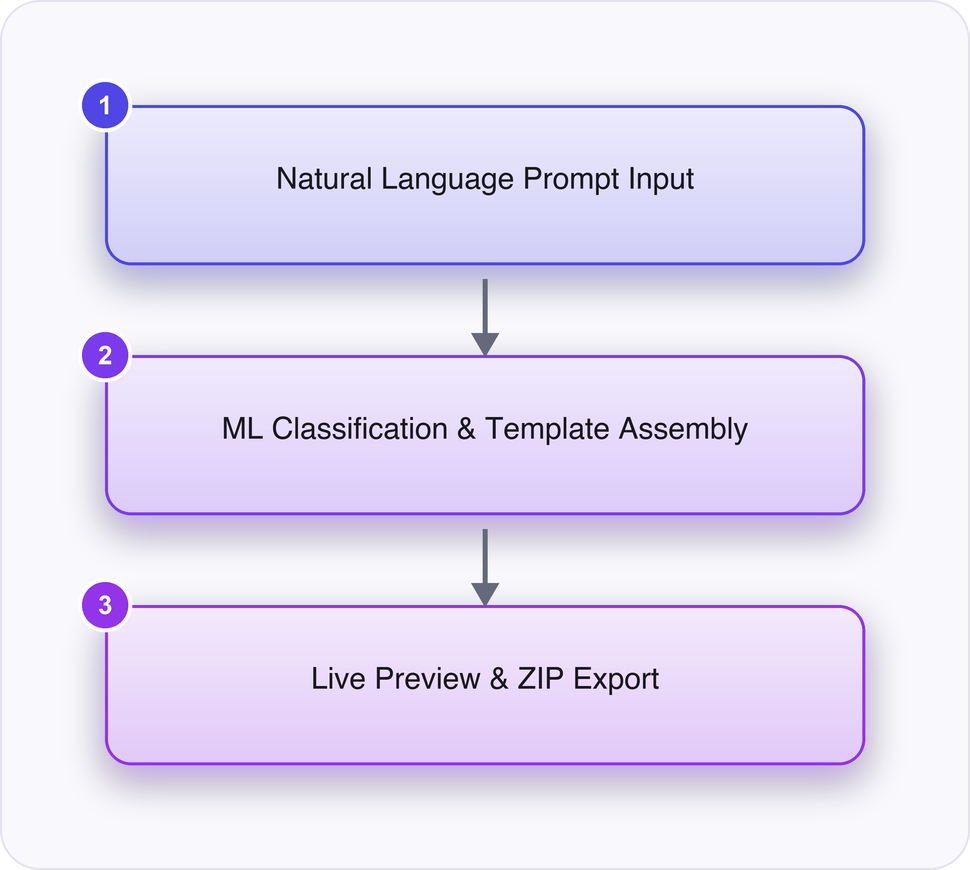
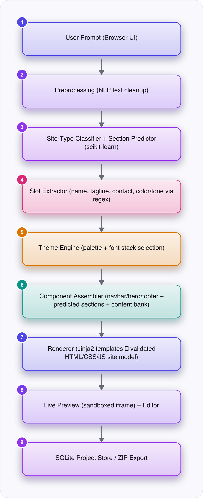
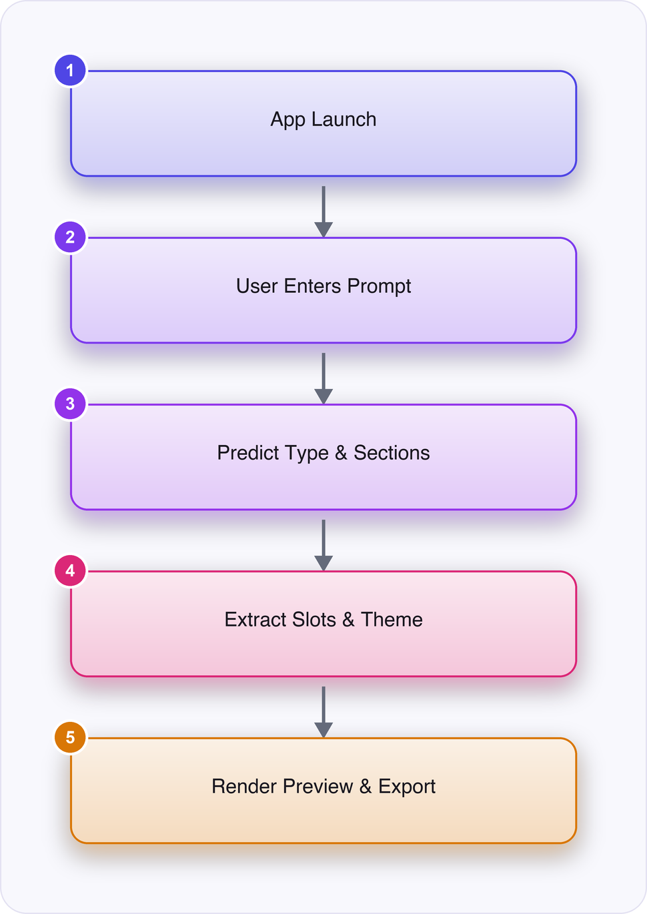

# AI Website Builder - High Level Document

# 📋 Research Details

| **Field** | **Value** |
| --- | --- |
| **Research Paper Title** | AI Website Builder |
| **Research Area** | Natural Language Processing / Generative AI for Web Development Automation |
| **Publication** | International Journal of Creative Research Thoughts (IJCRT) |
| **Publication Year** | 2025 |
| **Paper URL** | _(TODO: fill in)_ |
| **Paper PDF** | /Users/vijaysn/Downloads/IJCRTBH02018.pdf |
| **References** | Reddy, S.V., Bodhke, H., Patil, S., Gorad, R., Chavan, A., Mall, A.K. (2025). AI Website Builder. International Journal of Creative Research Thoughts (IJCRT), Volume 13, Issue 10, pp. 83-86, ISSN: 2320-2882, Paper ID IJCRTBH02018. |

---

# 💡 Project Overview

## Problem Statement

Building a professional website requires coding knowledge, design skill, time and money, so individuals, students and small businesses often cannot create one, and existing website builders still demand manual effort and offer limited flexibility.

### Proposed Solution

A local Flask web application where a user types a plain-English description of a desired website, two scikit-learn classifiers predict the site type and required sections, rule-based extraction pulls out the name/contact/theme details, and the system assembles and previews a complete responsive site from templates that can be edited and exported as an offline-ready ZIP.

### Expected Outcome

A working local app where a student can type a short description (e.g. "a bakery website called Sweet Crumbs"), see a live, responsive preview of a themed multi-section site generated in milliseconds, edit it, and export it as a self-contained HTML/CSS/JS ZIP — with the About page showing real measured accuracy and confidence figures for the demo.



---

# 🛠️ Implementation Approach

- The paper interprets free-text user requirements with transformer-based NLP (spaCy, Hugging Face), generates layouts with generative design models, and uses reinforcement learning to optimize content placement and design aesthetics, deployed via Flask/Django containerized on Vercel.
- Replaces the transformer-based interpretation with two lightweight scikit-learn classifiers (TF-IDF + logistic regression for site type, one-vs-rest logistic regression for sections), because training and serving transformer models needs GPU resources and large labelled datasets a student team does not have access to.
- Replaces the generative design model and reinforcement-learning layout optimizer with a fixed library of hand-written responsive section templates selected and ordered by simple per-type rules, because training a generative layout model or an RL policy within one semester is not feasible without extensive compute and a reward-labelled dataset.
- Builds and labels its own small training and evaluation prompt sets by hand instead of using the large benchmark/template datasets implied by the paper, because no public labelled dataset of natural-language-to-website-section mappings exists for this task.
- Runs as a single local Flask app with SQLite storage and ZIP export instead of a Flask/Django backend containerized on Vercel, because setting up and maintaining cloud deployment infrastructure is unnecessary overhead for a single-user academic demo.
- Adds an explicit low-confidence warning (probability threshold, vocabulary coverage, prompt length) that the paper does not describe, because a simplified classifier needs an honest, visible way to signal when its guess about site type/sections is unreliable.
- **Platform choice:** Chosen platform is a local Python Flask web application with a browser-based UI (not Android/Desktop/hosted web). This follows the already-agreed Project Information scope rather than the general mobile-first policy: the app is single-user and runs entirely on localhost (127.0.0.1:5050) with no accounts, hosting, or network calls, so it behaves like a desktop tool but reuses Flask/Jinja2/HTML/CSS/JS because the core deliverable — generated websites — is itself HTML/CSS/JS and a browser is the natural, zero-extra-tooling surface to preview and export that output.

---

# 🎯 MVP Scope

### Core Features

- Natural-language prompt analysis: two trained classifiers predict the website's site type (portfolio, restaurant, small business, education, blog, non-profit) and the sections it needs
- Rule-based detail extraction and theming: regex/word-list rules pull out site name, tagline, contact info and color/tone words, then pick a matching color palette and font stack
- Live responsive assembly and preview: predicted sections plus a mandatory navbar/hero/footer are filled from a content bank and rendered in a live, device-width-togglable preview
- Offline export: the previewed site is packaged into a downloadable ZIP (index.html, style.css, script.js) that runs with no external dependencies

---

# ⚙️ Recommended Technology Stack

| **Category** | **Technology** |
| --- | --- |
| Platform | Local Python Flask web application (browser UI, single-user, localhost only) |
| Programming Language | Python 3.11+ |
| Web/Template Layer | Flask, Jinja2, vanilla HTML/CSS/JavaScript |
| Machine Learning | scikit-learn (TF-IDF, logistic regression, one-vs-rest), pandas, numpy, joblib |
| Rule-Based Logic | Python regular expressions and word lists (slot extraction, theme selection) |
| Storage | SQLite (sqlite3) |
| Export | zipfile (Python standard library) |
| Testing | pytest; Playwright/Chrome for browser capture (development only) |

### Why this Tech Stack?

| **Technology** | **Reason** |
| --- | --- |
| Flask + Jinja2 | Lightweight enough for a student to run and understand locally, and Jinja2's autoescaping keeps user-entered text safe in generated pages without extra security code |
| scikit-learn (TF-IDF + logistic regression) | Gives interpretable probabilities for the low-confidence check and trains in seconds on a laptop, unlike transformer models which need GPUs and large datasets |
| SQLite | Needs no server setup and ships with Python, matching the single-user local-only scope |
| zipfile | Lets the exported site run completely offline as plain files, matching the 'no hosting' constraint |
| Regex/word-list rules for slots and theme | Deterministic and fully explainable for a student to defend in a viva, unlike a learned extraction model that would need its own training data |

---

# 🏗️ High-Level Architecture

```
User Prompt (Browser UI)
↓
Preprocessing (NLP text cleanup)
↓
Site-Type Classifier + Section Predictor (scikit-learn)
↓
Slot Extractor (name, tagline, contact, color/tone via regex)
↓
Theme Engine (palette + font stack selection)
↓
Component Assembler (navbar/hero/footer + predicted sections + content bank)
↓
Renderer (Jinja2 templates → validated HTML/CSS/JS site model)
↓
Live Preview (sandboxed iframe) + Editor
↓
SQLite Project Store / ZIP Export
```



---

# 🔄 Flow Chart



---

# 📦 Dependencies

| **Dependency** | **Required** |
| --- | --- |
| Python 3.11+ | ✅ |
| Flask | ✅ |
| scikit-learn / joblib (pre-trained artifacts) | ✅ |
| SQLite (bundled with Python) | ✅ |
| Internet Connection | ⚠️ Optional (only for initial pip install) |

---

# 🔍 Feasibility Assessment

| **Criteria** | **Assessment** |
| --- | --- |
| Backend Required | ✅ Yes |
| AI Model Training Required | ✅ Yes |
| Internet Required | ❌ No |
| Cloud Dependency | ❌ No |
| External Hardware | ❌ No |
| Dataset Required | ✅ Yes |
| Research Complexity | 🟢 Low |
| Development Complexity | 🟡 Medium |
| Cost | 🟢 Low |
| Suitable for Offline Demo | ✅ Yes |

---

# ⭐ Project Evaluation

| **Parameter** | **Score (/10)** |
| --- | --- |
| Ease of Implementation | 8 |
| Student Understanding | 8 |
| Demonstration Value | 9 |
| Innovation | 6 |
| Industry Relevance | 8 |
| Current Trend | 9 |
| Learning Value | 8 |
| Future Scalability | 6 |
| Maintainability | 8 |

---
